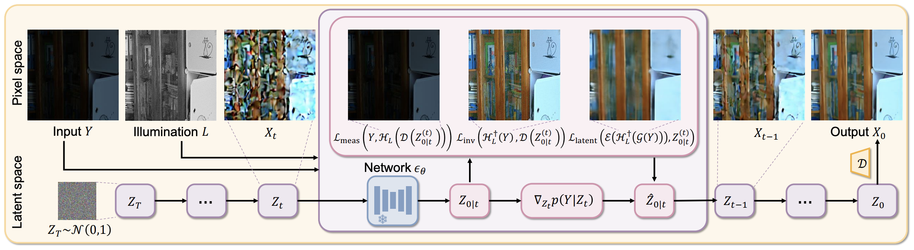

# LLIEDiff
[AAAI 2025] Official implementation of the paper "Zero-Shot Low-Light Image Enhancement via Latent Diffusion Models"

# Introduction
We present **LLIEDiff** with:

1. **Zero-shot & pretrained**: A zero-shot LLIE framework leveraging pre-trained latent diffusion models for the first time, which act as powerful priors to recover latent images from low-light inputs. 
2. **Contribution**: Modeling the degradation process in an image-adaptive manner, penalizing the latent outside the manifold of natural images, and balancing the strengths of the guidance from the given low-light image during the denoising process.

# Methods


## Run

```sh
  bash run.sh --indir /path/to/your/test_images --model_id /path/to/your/checkpoint
```
